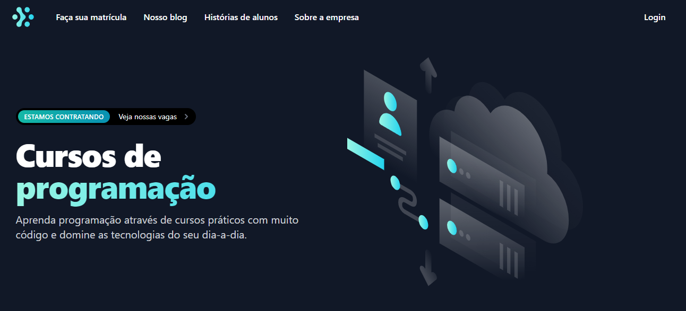
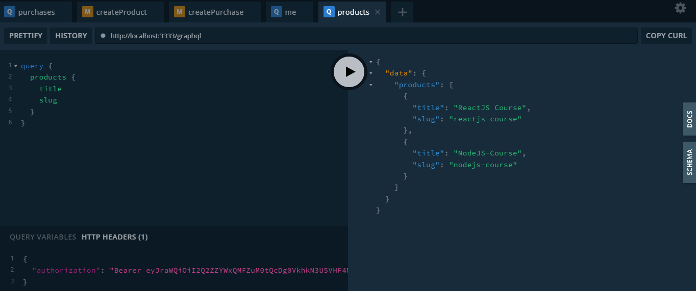
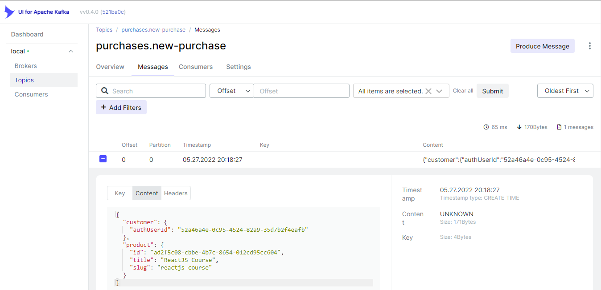
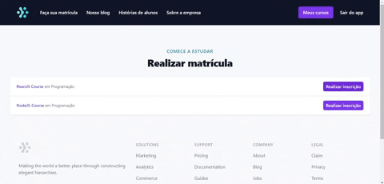
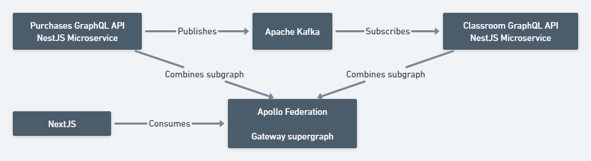
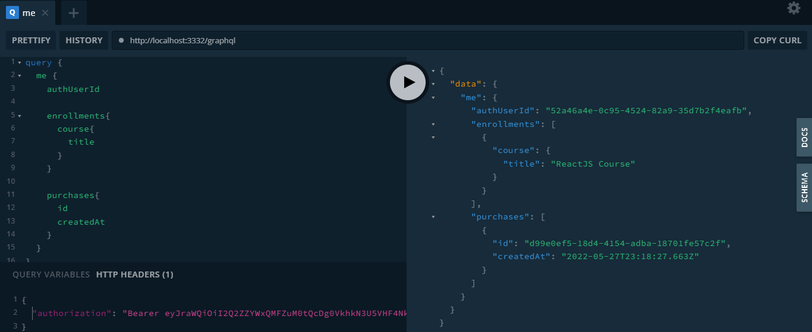
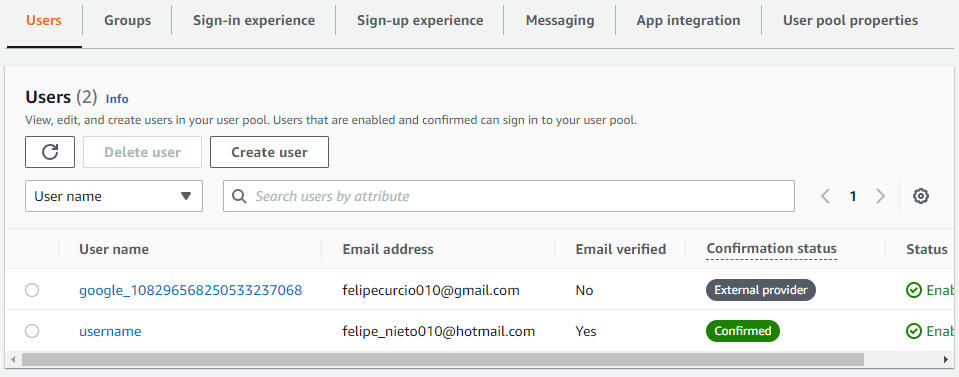
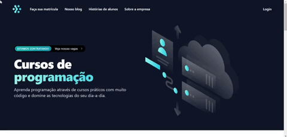

# GraphQL with NestJS and NextJS

> A platform that sells courses. It uses NextJS on the front-end and two NestJS services on the back-end, purchases and classroom, that communicate through Kafka messaging system.

<p align="center">

</p>

## Rocketseat Education

I studied the construction of this project at Rocketseat's Ignite lab. The project uses the GraphQL communication pattern through the integration of Apollo and Typescript with Nestjs. At first, the authentication service utilized was Auth0, but after I finished, I decided to switch to AWS Cognito for learning purposes and enable authentication with Google's OAuth.

It was a great experience since this project was my first contact with GraphQL and Apache Kafka.

## GraphQL

GraphQL is a communication pattern between services, a different approach from REST. The client explicitly tells the service what it wants to fetch from the server through a query. It avoids over-fetching and under-fetching data. For example, we can fetch products and get only the information that we need, like the title and the slug of the products:

<p align="center">
  
</p>

GraphQL makes use of a schema to build its API documentation. A GraphQL API is made either utilizing schema first or code first approach.

The project uses Apollo Federation to unify the two services, classroom, and purchase, through a gateway, with that we can make queries that contemplate both as one.

## Apache Kafka

Kafka is an event streaming platform. Its purpose in this project is to communicate with the Purchases and Classroom services. In a way that when there's a new purchase by a Customer, the purchase service will emit an event to Kafka.

The classroom is listening for events from Kafka will enroll the student in the purchased course. One of the advantages of using Kafka is that the event messages stored will remain as needed, which means that even if the classroom service were offline, the purchase service would still be able to make a purchase. As soon as the classroom was online, it would be able to retrieve Kafka events and perform the necessary operations on the server, such as enrolling a student in a course.

The classroom is the subscriber, and the purchase is the publisher of events on Kafka. The image below shows a message stored within a topic "purchases.new-purchase":

<p align="center">
  
</p>

The classroom service subscribes to the "purchases. new-purchase" topic. Therefore, when there's a new purchase, there will be automatically created the proper student, course, and enrollment. The below gif illustrates that process, first lists products, then got enrolled at ReactJS Course, access "My courses" and then makes an F5 page refresh on the Prisma studio classroom service to show the created enrollment:



## Apollo Federation

With Apollo Federation, our GraphQL APIs are subgraphs, and they're composed into a supergraph. By querying your supergraph, clients can query all of your subgraphs together. It means our Client-side can consume the GraphQL through a supergraph gateway that is composed of our two GraphQL API microservices, purchases, and classroom, see the illustration image:

<p align="center">
  
</p>

When creating the apollo client (for authenticated requests), we can assign the target URI to our Nextjs API route.

```js
const httpLink = createHttpLink({
  uri: 'http://localhost:3000/api',
  fetch,
});
```

With Next.js is possible to make a proxy middleware in the entry point of API routes:

```js
return httpProxyMiddleware(req, res, {
    target: 'http://localhost:3332/graphql',
    headers: {
      Authorization: `Bearer ${accessToken}`,
    },
  });
}
```

It was necessary to use that proxy middleware because with [Auth0](https://auth0.com/), we cannot get the accessToken in a client-side environment, only on the server-side as in the API routes. But at the end of the course, I decided to use AWS Cognito as the authentication service and hence was able to directly point the apollo client to the gateway as was already being done with unauthenticated requests, just passing the headers property when creating the apollo client:

```js
const cookies = parseCookies(ctx);
const { 'cognito.accessToken': accessToken } = cookies;

const httpLink = createHttpLink({
  uri: 'http://localhost:3332/graphql',
  headers: {
    authorization: `Bearer ${accessToken}`,
  },
  fetch,
});
```

With the gateway running on localhost:3332 we can get data from both services, classroom (enrollments resolver) and purchases (purchases resolver):



## AWS Cognito

AWS Cognito is an authentication service likewise Auth0. In Cognito, you must configure a user pool and an App Client. Once configured, you can authenticate users with Cognito and store them in the service:



For Google OAuth, you must configure the social identity provider and add a Cognito domain. After adding the Google identity provider, making Google OAuth authentication requires some additional steps:

1 - make a GET request to:

```
https://<cognito-domain>.auth.<region>.amazoncognito.com/oauth2/authorize?response_type=code&client_id=<cognito Client ID>&redirect_uri=<callback_url_configured_to_the_app_client>
```

2 - That request returns a code in the query params, my project_uri points to "localhost:3000/api/callback", from there I make a POST request passing that code from the query params to:

```
https://<cognito-domain>.auth.<region>.amazoncognito.com/oauth2/token
```

This request returns an access token that will be applied to make authenticated requests to the classroom and purchase services with the apollo client. I recommended reading that article from AWS Cognito: [Understanding Amazon Cognito user pool OAuth 2.0 grants
](https://aws.amazon.com/blogs/mobile/understanding-amazon-cognito-user-pool-oauth-2-0-grants/). Finally, we can authenticate with Google OAuth:



Changing from Auth0 to Cognito wasn't difficult on the server-side. I just had to modify AuthorizationGuard class that implements CanActive from Nestjs.

## Prisma

Prisma is an object-relational mapper (ORM) that helps set up a database (Postgres in this project). With Prisma, we can define a schema, make queries, migrations in the database, visualize and modify the data with prisma studio.

## Docker

Docker runs a service, or an application, in an isolated environment called a container. In that way, we can separate our applications from the infrastructure. This project uses Docker containers to set up Kafka and PostgreSQL services. It uses those running services, for example, Prisma connects to the database running in that container.

## Running the application:

- Docker

```shell
docker-compose up -d
```

- Purchases microservice

```shell
cd purchases

npx prisma migrate dev

npm run start
```

- Classroom microservice

```shell
cd classroom

npx prisma migrate dev

npm run start
```

- Gateway

```shell
cd gateway

npm run start
```

- NextJS

```shell
cd web

npm run dev
```
